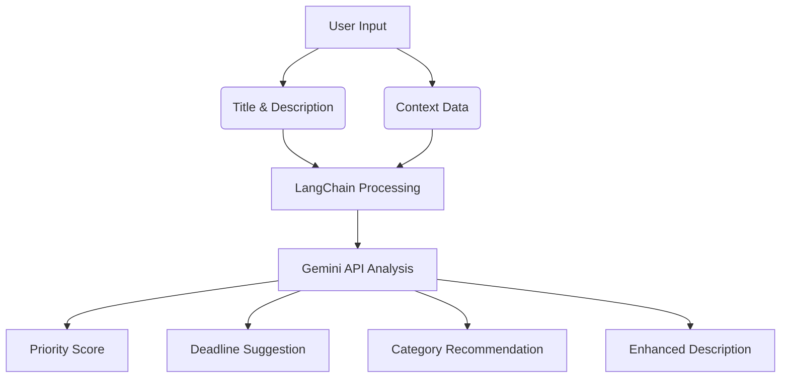

# 🧠 Smart Todo List with AI


An intelligent full-stack task management system that uses **LangChain** + **Gemini API** to enhance productivity with AI-powered features like smart prioritization, context-aware suggestions, and deadline recommendations.

## 🚀 Features

- ✅ AI-Powered Task Management using **LangChain + Gemini**
- ✅ Task Prioritization & Deadline Recommendations
- ✅ Context-Aware Task Suggestions from WhatsApp, Emails, and Notes
- ✅ Smart Task Categorization & Description Enhancement
- ✅ Modern UI with Filtering, Search, and Priority Indicators
- ✅ Next.js + Tailwind CSS Frontend
- ✅ Django REST Framework Backend
- ✅ Supabase PostgreSQL Integration

## 🧩 Tech Stack

### Frontend
- **Next.js** (React Framework)
- **Tailwind CSS** (Styling)
- TypeScript (Optional)

### Backend
- **Django REST Framework**
- Python 3.9+

### Database
- **Supabase PostgreSQL**

### AI Integration
- **LangChain**
- **Gemini API**

### Infrastructure
- Supabase (Auth/Storage)
- Postman (API Testing)
- GitHub (Version Control)

## 📸 Screenshots

| Feature | Preview |
|---------|---------|
| 🖥️ Task Dashboard |  |
| ✍️ AI Task Creation |  |
| 📚 Category Input |  |
| 📋 AI Suggestions |  |

## 🧠 How AI Works

The system uses **LangChain with Gemini API** to analyze context data (e.g., WhatsApp chats, notes) and task details:



### 🔍 Sample AI Suggestion

**Input Task**:
- **Title**: Submit Project Report
- **Description**: Prepare and submit final version
- **Category**: You can select category or manually create it
- **Context**: "Reminder: report deadline by Monday morning"

**AI Output**:
- ⚡ Priority Score: `9.5/10` 
- 📅 Suggested Deadline: `Monday, 10:00 AM`
- 🏷️ Category: `Work > Project`
- ✍️ Enhanced Description: *Submit the final version of the project report including performance metrics before the Monday morning review meeting.*

## 🔧 Setup Instructions

### Backend Setup

```bash
# Clone repository
git clone https://github.com/shahpankaj123/Smart-Todo-List-with-AI.git
cd backend

# Create virtual environment
python -m venv env
source env/bin/activate  # Linux/Mac
# env\Scripts\activate   # Windows

# Install dependencies
pip install -r requirements.txt
```

### Environment Variables

Create `.env` file in backend directory:

```ini
DB_PASSWORD="your_db_password"
DB_USERNAME="your_db_username"
DB_NAME="smart_todo_db"
EMAIL_USERNAME="your_email"
EMAIL_PASSWORD="your_email_password"
GEMINI_KEY="your_gemini_api_key"
```

### Database Migration

```bash
python manage.py migrate
python manage.py runserver
```

### Frontend Setup

```bash
cd ../frontend
npm install
npm run dev
```

## 📚 Database Schema

```sql
-- Tasks Table
CREATE TABLE tasks (
    TaskID SERIAL PRIMARY KEY,
    Title VARCHAR(255),
    Description TEXT,
    Category VARCHAR(100),
    AI_Description TEXT,
    PriorityScore DECIMAL(3,1),
    Deadline TIMESTAMP,
    Status VARCHAR(50),
    CreatedAt TIMESTAMP DEFAULT CURRENT_TIMESTAMP
);

-- Context Table
CREATE TABLE context (
    ContextID SERIAL PRIMARY KEY,
    Content TEXT,
    SourceType VARCHAR(50),
    Insights TEXT,
    CreatedAt TIMESTAMP DEFAULT CURRENT_TIMESTAMP
);
```

## 📬 API Documentation

[](https://documenter.getpostman.com/view/28967857/2sB34cnh5S)

Key Endpoints:
- `GET /api/tasks` - List all tasks
- `POST /api/tasks` - Create new task with AI
- `POST /api/context` - Add context data
- `GET /api/suggestions` - Get AI suggestions
- `....` - More on Document

## 🎁 Bonus Features

- 🌙 Dark/Light Mode Toggle
- 📱 Fully Responsive Design
- 📤 CSV/PDF Export (Planned)
- 🗓️ Interactive Calendar View
- 🔍 Real-time Search & Filters

## 🎁 Future Features
 - Login System

## 🙋 About the Developer

**👨‍💻 Pankaj Sah**  
📧 pshah9360@gmail.com  
📍 Nepal  

[](https://github.com/shahpankaj123)

## 📝 License

This project is licensed under the MIT License - see the [LICENSE](LICENSE) file for details.
```

### Key Markdown Features Used:

1. **Headers**: `#`, `##`, `###` for section hierarchy
2. **Lists**: Both bullet (`-`) and numbered lists
3. **Tables**: For feature comparison and screenshots
4. **Code Blocks**: Triple backticks for bash commands and SQL
5. **Mermaid Diagram**: For AI workflow visualization
6. **Badges**: For API documentation link
7. **Emojis**: For visual appeal and quick scanning
8. **Links**: Both inline and badge-style
9. **Inline Code**: Single backticks for technical terms
10. **Bold/Italic**: For emphasis

To use this markdown:
1. Save as `README.md` in your project root
2. Replace placeholder URLs with your actual images/links
3. Update the GitHub username and repository details
4. Add your actual Postman documentation link
5. Customize any sections as needed for your specific implementation


